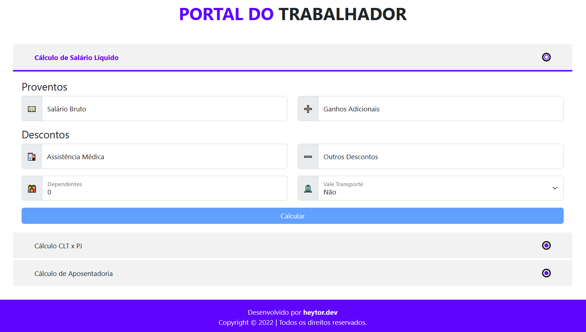

<h1 align="center">
    <a href="https://ctps.heytor.dev">
        <b>Brazilian Worker</b>
    </a>
</h1>

<p align="center">
    
    
    
</p>

<p align="center">A tool for brazilian workers to help them with better understanding about your salary.</p>



## 📋 Table of Contents
- [🚀 Features](#-features)
- [🏗️ Build with](#️-build-with)
- [🏇 How to Use](#-how-to-use)
- [👨‍💻 Development](#-development)
  - [🧵 Code Styleguide ](#-code-styleguide-)
  - [📏 Branch and Commit Nomeclature](#-branch-and-commit-nomeclature)
  - [🧪 Tests](#-tests)
  - [🙌 How to Contribute](#-how-to-contribute)
- [🆘 Getting Help](#-getting-help)


## 🚀 Features
* Calculate CLT Liquid Salary
* Calculate PJ Liquid Salary

  ### <b>Coming Soon:</b>
* Compare CLT x PJ
* Compare PJ X CLT
* Calculate Thirteen Salary
* Calculate Vacation Salary
* Calculate Retired Time

## 🏗️ Build with
* Python
* FastAPI
* Deta
* Typescript
* Angular
* Bootstrap
* Vercel

## 🏇 How to Use
To clone and run this application, you'll need [Git](https://git-scm.com) and [Docker](https://www.docker.com/) installed on your computer. From your command line:

```bash
# Clone this repository
git clone https://github.com/heytorvas/brazilian-worker.git

# Access the project folder
cd brazilian-worker

# Run the application
docker-compose up --build &
```

## 👨‍💻 Development

### 🧵 <b>Code Styleguide </b>
To ensure that the project style guide is being followed, the pre-commit needs to be installed:

1. Install pre-commit
```bash
pip install pre-commit
```
2. Install hooks
```bash
pre-commit install
```

### 📏 <b>Branch and Commit Nomeclature</b>

Always create a new branch when adding a change to the project. Branch names show be preceded by the same prefixes as commit messages, depending on the type of change introduced. The prefix should be followed by a bar and then a name which briefly describes the change. The prefix list is located on [this paper](https://github.com/angular/angular/blob/main/CONTRIBUTING.md#type) created by Angular Team.

A couple of example of branch names:

```
feat/new-feature-description
```

or

```
fix/bug-to-be-fixed
```

### 🧪 <b>Tests</b>

To run the tests, including unit and integration, run the following commands:

```bash
# With API running, access the container
docker-compose exec -it api bash

# Run the tests
python -m pytest tests/
```

### 🙌 <b>How to Contribute</b>

1. Clone this repository and create a new branch
```bash
git checkout https://github.com/heytorvas/brazilian-worker.git -b <NEW_BRANCH_NAME>
```

2. Make your changes and tests

3. Submit a pull request with comprehensive description of changes

## 🆘 Getting Help

If you have any questions, feel free to contact me on [LinkedIn](https://www.linkedin.com/in/heytorvictor/) or, whether you prefer, [open an issue](https://github.com/heytorvas/brazilian-worker/issues/new) on this repository.
